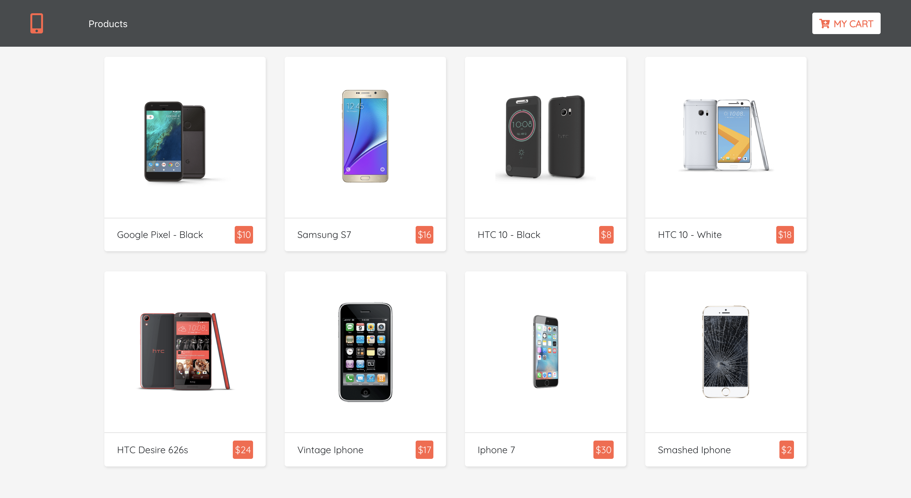
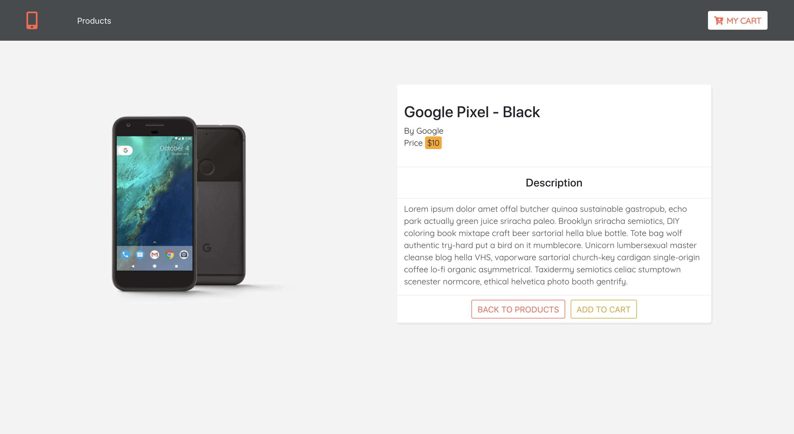
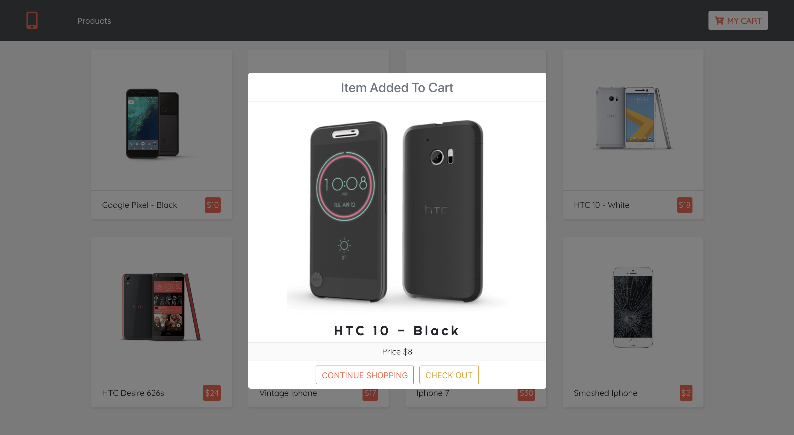
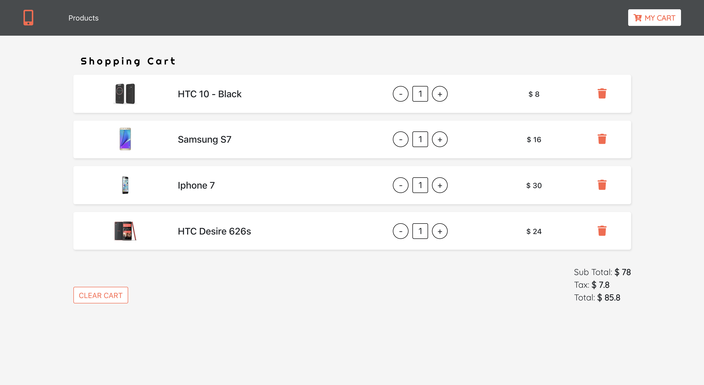
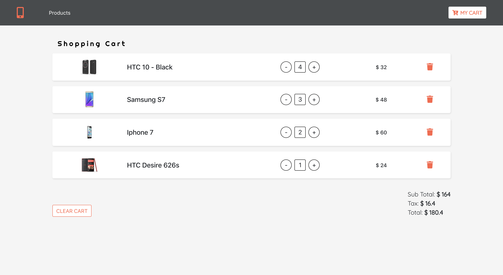
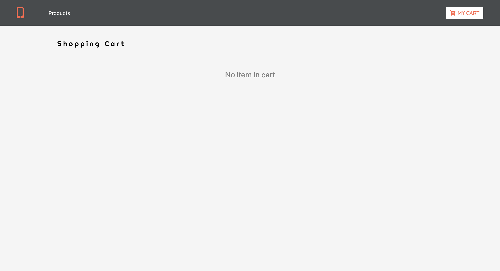

## Shoppia Store
Shoppia is an e-commerce web site powered by React and Context API

##### Views
`Products View`
 

`Detail View`
 

`Feedback Modal View`
 

`Cart View Onload`
 

`Cart View On User Interaction`
 

`Feedback Modal View`
 

#### Available Scripts
In the project directory, you can run:

##### `npm start`

Runs the app in the development mode. 
Open [http://localhost:3000](http://localhost:3000) to view it in the browser.

The page will reload if you make edits.
You will also see any lint errors in the console.

##### `npm test`
Launches the test runner in the interactive watch mode.

##### `npm run build`
Builds the app for production to the `build` folder.

#### Inspiration Source
[FreeCodeCamp](https://www.freecodecamp.org/news/react-tutorial-ecomerce-site/)